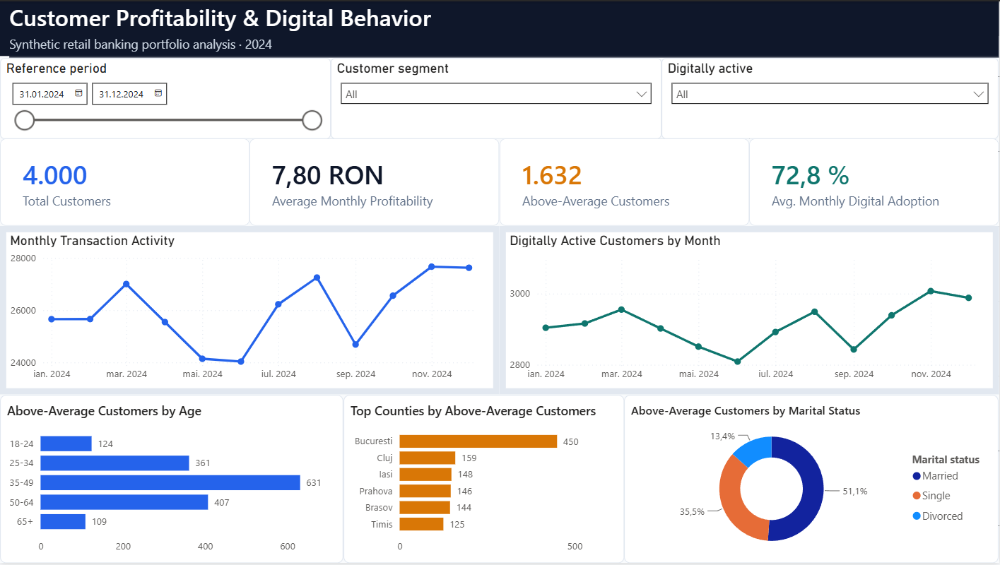
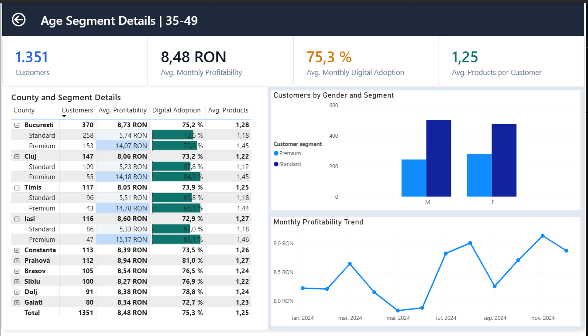
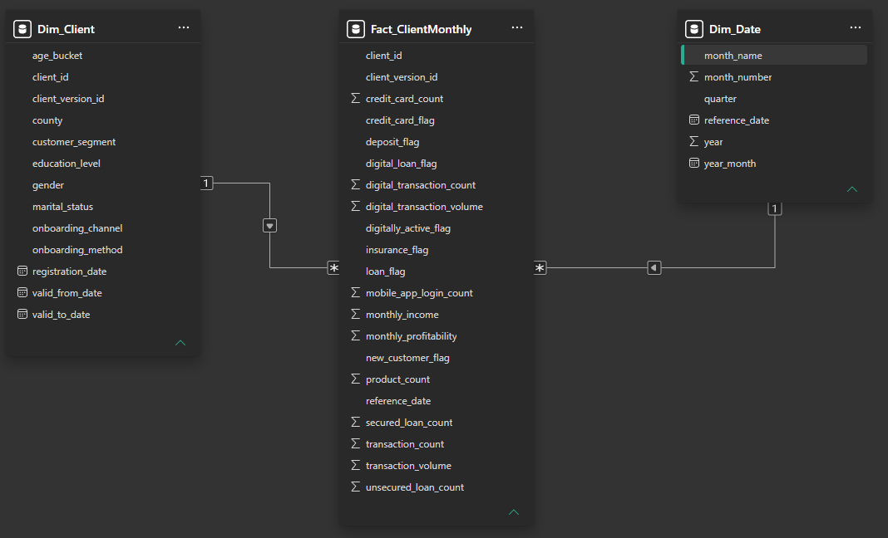

# Customer Profitability & Digital Behavior Dashboard

An interactive Power BI portfolio project for exploring customer profitability, transactional activity, digital adoption, and demographic segments in a fictional retail bank.



> **Data and affiliation notice:** This public portfolio version uses an independently generated, fully synthetic dataset. It contains no real customer records, confidential information, or original company data. The underlying team assignment was completed during a short BCR internship program; this repository is an educational portfolio project and is not an official BCR product. BCR did not sponsor or endorse this public repository.

## Business objective

The report answers five questions:

1. How profitable is the customer portfolio?
2. How many customers generate above-average profitability?
3. How do transaction activity and digital adoption change over time?
4. Which demographic and geographic segments contain profitable customers?
5. How do profitability, digital adoption, and product ownership differ by age segment?

## Dashboard features

- KPI cards with filter-aware DAX measures;
- monthly transaction and digital-adoption trends;
- demographic and county segmentation;
- date, customer-segment, and digital-activity slicers;
- reset-filters bookmark;
- custom tooltips;
- age-segment drill-through page with a dynamic title;
- expandable county/segment matrix with conditional formatting;
- desktop and mobile-optimized layouts;
- SCD Type 2 customer dimension.

## Key findings from the synthetic dataset

- The portfolio contains **4,000 fictional customers** with an average monthly profitability of **7.80 RON**.
- **1,632 customers** generate above-average profitability over the selected annual period.
- Average monthly digital adoption is **72.8%**.
- Customers aged **35-49** form the largest above-average group, with **631** customers.
- Bucharest has the largest above-average customer count (**450**) in the fictional geographic distribution.
- Transaction activity reaches its lowest point in June (**24,034**) and its highest point in November (**27,667**).

These findings describe only the generated demonstration dataset and must not
be interpreted as information about a real bank or population.

## Drill-through analysis

Right-clicking an age group on the Overview page opens a filtered detail page. It compares customer count, profitability, digital adoption, product ownership, gender, customer segment, and county.



## Data model

The model uses a compact star schema:

- `Dim_Client`: versioned fictional customer attributes (SCD Type 2);
- `Dim_Date`: one row per monthly reference date;
- `Fact_ClientMonthly`: one observation per customer and month;
- `_Measures`: DAX measures used by the report.



Relationships use one-to-many cardinality and single-direction filtering from the dimensions to the fact table. See [the model documentation](docs/data-model.md) and [data dictionary](docs/data-dictionary.md).

## Repository structure

```text
dashboard/             Final Power BI report (.pbix)
data/                  Generated synthetic CSV files
dax/measures.dax       Documented DAX measures
docs/                  Model, requirements, and setup notes
images/                Dashboard, drill-through, and model previews
scripts/               Reproducible synthetic-data generator
```

## Reproduce the project

Requirements:

- Windows 11;
- Power BI Desktop;
- Python 3.10 or newer (only for regenerating data).

Regenerate the dataset (no third-party Python packages):

``` powershell
py scripts\generate_synthetic_data.py
```

The fixed random seed recreates:

- 4,000 fictional customers;
- 12 monthly reference dates;
- 48,000 customer-month observations.

Open `dashboard/Customer-Profitability-Synthetic.pbix` in Power BI Desktop. If the project was moved, update the three CSV paths in Power Query and refresh. Detailed instructions are available in [docs/power-bi-setup.md](docs/power-bi-setup.md).

## My contribution

The original dashboard was developed as a team assignment. My contributions included:

- data preparation and transformation in Power Query;
- development and validation of DAX measures;
- dashboard layout, visual design, and interaction design.

I independently rebuilt the public portfolio version with synthetic data, neutral field names, additional drill-through and mobile layouts, privacy checks, and reproducible documentation.

## Tools and skills demonstrated

Power BI Desktop, Power Query, DAX, dimensional modeling, SCD Type 2, synthetic-data generation, interactive report design, drill-through, bookmarks, mobile layouts, performance analysis, accessibility checks, Git, and GitHub documentation.

## Limitations

- The relationships between variables were intentionally introduced for demonstration purposes.
- Profitability is a fictional analytical metric, not an accounting measure.
- Data covers one synthetic year and should not be used for forecasting.
- The binary PBIX is included for convenient review; the documented DAX, generator, model, and CSV files provide the auditable project components.
